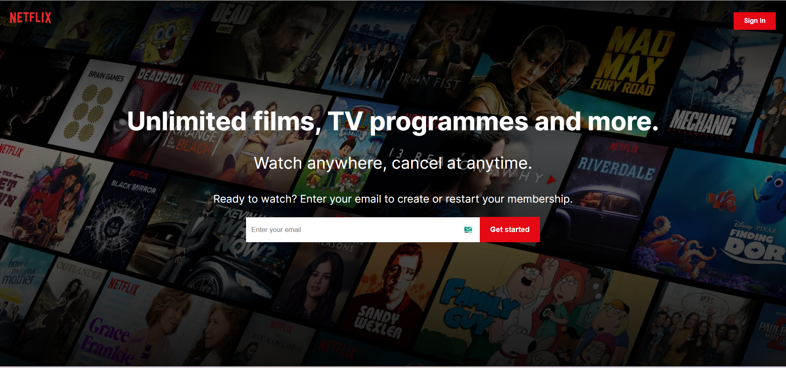

# Netflix Clone 3.0

## Description

Netflix Clone 3.0 is a web application built using React.js, TMDB's API, and Firebase for user authentication. It emulates the popular streaming service, Netflix, allowing users to browse and discover a catalog of movies and TV shows.

## Table of Contents

- [Features](#features)
- [Technologies Used](#technologies-used)
- [Installation](#installation)
- [Usage](#usage)
- [Screenshots](#screenshots)
- [Contributing](#contributing)
- [License](#license)

## Features

1. **Login Screen:** Users can log in to the application using their credentials. Firebase authentication ensures secure access to the platform.

2. **Home Screen:** The main screen displays a collection of movies and TV shows fetched from TMDB's API. Users can explore titles, view details, and choose what to watch.

3. **Profile Screen:** Users have personalized profile screens where they can manage their account settings and preferences.

## Technologies Used

- React.js: A JavaScript library for building user interfaces, providing a responsive and interactive user experience.
- HTML and CSS: Used for structuring and styling the application, ensuring an appealing visual design.
- TMDB API: The Movie Database API offers a vast repository of movie and TV show information, allowing the app to access rich media data.
- Firebase: Used for user authentication, ensuring secure access and profile management.

## Installation

1. Clone the repository: `git clone https://github.com/your-username/netflix-clone-3.0.git`
2. Navigate to the project directory: `cd netflix-clone-3.0`
3. Install dependencies: `npm install`

## Usage

1. Obtain an API key from TMDB by signing up at https://www.themoviedb.org/. Add the API key in the appropriate file to fetch movie data.
2. Set up a Firebase project and configure the Firebase authentication settings.
3. Run the application: `npm start`
4. Open your web browser and go to `http://localhost:3000` to access the Netflix Clone 3.0 application.

## Screenshots

_Login Screen_

_Home Screen_

_Profile Screen_

## Contributing

Contributions are welcome! If you find any issues or want to enhance the application, please submit a pull request.

## License

This project is licensed under the [MIT License](./LICENSE).
